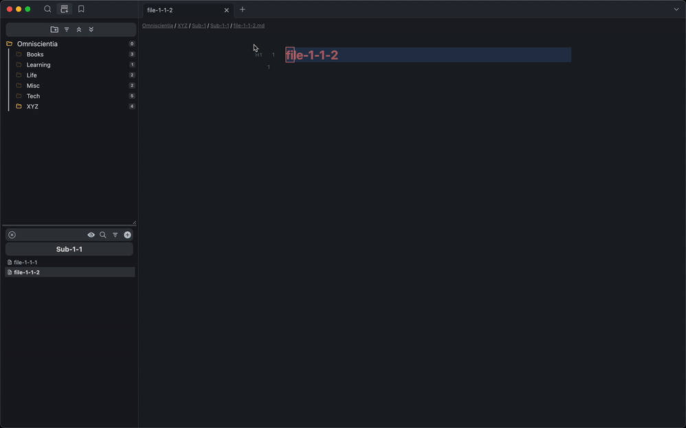

# A plugin that provides a VSCode-style breadcrumbs

 
from https://code.visualstudio.com/docs/editor/editingevolved#_breadcrumbs

## Background
As the number of files increases and the depth of folders grows, it becomes increasingly challenging to quickly determine the current location of a file solely through the sidebar. For those who often feel insecure when getting lost in deep folders, this plugin provide a more obvious hint that includes basic navigation features.

## Demo

## Features

1. Customize breadcrumbs style
   - color (font, separator, background)
   - font size
   - separator symbol
2. Navigation
   - Default (file core plugin)
  only support `file-explorer:reveal-active-file`
   - [File tree alternative](https://github.com/ozntel/file-tree-alternative)
  You can navigate to a folder or reveal the active file by pressing the `breadcrumbs`. However, if you click on a hidden folder, we will simply replace its name in the breadcrumbs. To indicate a hidden folder, we will add the ⊝ symbol before the folder name.
